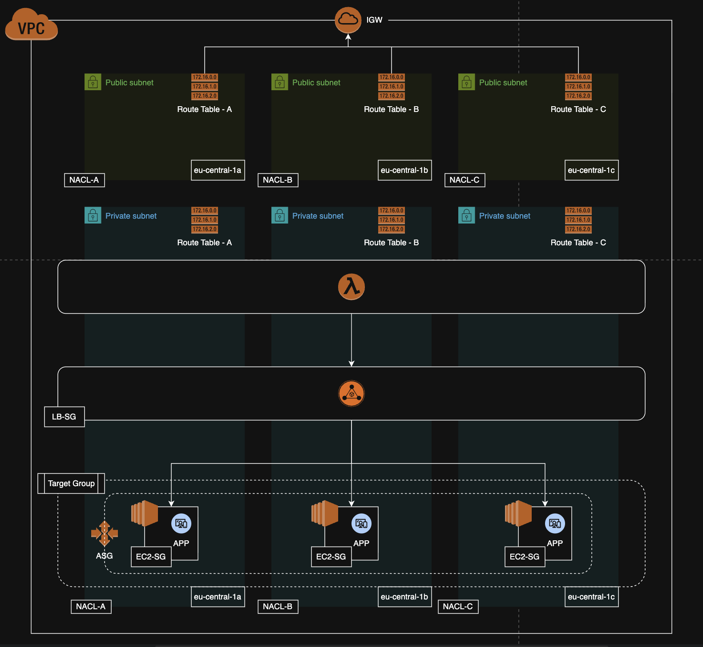

# Phoenix – Self-Healing Internal AWS Infrastructure

## Project Description

Phoenix is a minimal, self-healing internal AWS service rebuilt entirely through Infrastructure-as-Code using Packer and Terraform.

It runs stateless EC2 instances behind an Auto Scaling Group, serves a simple **“It’s working”** endpoint, and is fully reproducible from code. The design emphasizes immutability, controlled validation, cost-awareness, and internal-only access.

This is a Proof of Concept environment focused on automated rebuild capability rather than a full production-grade system.

# Table of Contents

1. [Architecture Overview](#1-architecture-overview)  
2. [Assumptions](#2-assumptions)  
3. [Modes of Deployment](#3-modes-of-deployment)  
   - [Easy Mode (Evaluator Mode)](#31-easy-mode-evaluator-mode)  
   - [Fully Flexible Mode](#32-fully-flexible-mode)  
4. [Destroy Infrastructure](#4-destroy-infrastructure)  
5. [Infrastructure Design & Decisions](#5-infrastructure-design--decisions)  

---

# 1. Architecture Overview

### Infrastructure Flow

```
Backend (S3 + DynamoDB)
        ↓
Network (VPC, Subnets, IGW)
        ↓
Packer (Golden/Baked AMI)
        ↓
Application (ALB + ASG)
        ↓
Validation (Lambda → ALB)
```

### Infrastructure Diagram



### Project Structure

* `packer/` – Builds the baked AMI used by the fleet.
* `terraform/resources/terraform_backend/` – Remote state backend (S3 + DynamoDB).
* `terraform/resources/network_architecture/` – VPC, subnets, routing, and network controls.
* `terraform/resources/application_architecture/` – ALB, Target Group, Launch Template, and Auto Scaling Group.
* `terraform/resources/validation_architecture/` – Validation components for health and behavior checks.
* `terraform/modules/` – Reusable Terraform modules.
* `phoenix_utility/app.py` – Evaluator-friendly automation utility.
* `docs/` - Documentations to run terraform and packer independently.

Each layer (backend, network, application, validation) can be deployed independently while also supporting a full automated run.

---

# 2. Assumptions

### Region

`eu-central-1`

### Scaling

Maximum 10 EC2 instances per subnet.

### Subnet Sizing

`/28` subnet  
- 16 total IPs  
- 5 reserved by AWS  
- 11 usable  

Designed to avoid unnecessary IP waste while maintaining headroom.

### Service Characteristics

- Stateless workload  
- Internal-only service  
- No database required  
- No public exposure  

### IAM

- IAM roles and policies are not provisioned by this stack  
- Terraform execution role must already exist  
- Least privilege expected  

### Deployment Scope

- Manual Terraform & Packer execution  
- No CI/CD integration  


---

# 3. Modes of Deployment

## 3.1 Easy Mode (Evaluator Mode)

Fastest way to deploy and validate.

### Prerequisites

| Tool      | Verify                |
|-----------|-----------------------|
| AWS CLI   | `aws --version`       |
| Terraform | `terraform --version` |
| Packer    | `packer --version`    |
| Python 3  | `python3 --version`   |

Install boto3:

```bash
python3 -m pip install boto3
```

Configure AWS:

```bash
aws configure
```

* Region: `eu-central-1`
* Output format: `json`

Verify:

```bash
aws sts get-caller-identity
```

---

### Deploy Infrastructure

#### Automated Mode

```bash
cd phoenix_infra/phoenix_utility
python3 app.py automated eu-central-1
```

#### Partial Mode

```bash
cd phoenix_infra/phoenix_utility
python3 app.py partial eu-central-1 \
  --vpc-id <vpc_id> \
  --public-subnet-cidrs  <public_subnet_cidr_1>  <public_subnet_cidr_2> <public_subnet_cidr_3> \
  --protected-subnet-cidrs <protected_subnet_cidr_1>  <protected_subnet_cidr_2> <protected_subnet_cidr_3>
```

This provisions:

- Terraform backend  
- Network  
- Golden AMI  
- Application (ALB + ASG)  
- Validation Lambda  

---

### Validate Service

Invoke validation:

```bash
python3 app.py validation eu-central-1 lambda
```

Expected response:

```json
{
  "statusCode": 200,
  "body": "{\"message\":\"It's working\",\"status\":200}"
}
```

List instances:

```bash
python3 app.py validation eu-central-1 list
```

Test auto-healing:

```bash
python3 app.py validation eu-central-1 delete
```

Verify replacement:

```bash
python3 app.py validation eu-central-1 list
```

---

## 3.2 Fully Flexible Mode

For modular deployment:

```
terraform/
packer/
```

Each layer (backend, network, application, validation) can be deployed independently.

Detailed module documentation is available under:

```
docs/
```

---

# 4. Destroy Infrastructure

```bash
python3 app.py destroy eu-central-1
```

---

# 5. Infrastructure Design & Decisions

## Architecture Choice

**Selected Pattern**

EC2 + Auto Scaling Group + Internal ALB + Baked AMI

### Why

- Demonstrates immutable infrastructure
- Shows machine-level replacement
- Fully rebuildable from code
- Internal-only service

### Alternatives Considered

| Option | Reason Not Selected |
|--------|--------------------|
| Lambda + API Gateway | No machine-level immutability |
| ECS / Fargate | Container-focused |
| EKS | Operationally heavy |
| Spot Instances | Interruptible |

On-Demand EC2 selected for predictability and stability.

---

## Cost Considerations

- Minimal instance sizing  
- No NAT Gateway  
- No Elastic IP  
- No public ALB  
- Right-sized CIDR blocks  

Reserved Instances / Savings Plans excluded due to assignment scope.

---

## Network Design

- Application runs in protected subnets  
- Public subnets used only during AMI build phase  
- No NAT Gateway  
- No bastion host  
- No direct public access  

Validation performed via Lambda inside the VPC.

---

## Testing & Validation Design

Lambda invokes the internal ALB using Python's `requests` module.

Benefits:

- Lambda and ALB are placed in the same protected subnets  
- No public subnet required  
- No Elastic IP required  
- No NAT Gateway required  
- No public exposure of the application  
- Controlled access via IAM  

Alternative bastion approach rejected due to increased cost and additional public-facing components.


---

## Repository & Credential Handling

- No AWS credentials stored in Git  
- AWS CLI expected to be configured locally  
- IAM expected to follow least privilege  
- Private repository intentionally avoided to reduce evaluator onboarding friction  

---

## Infrastructure Behavior

- Fully code-driven  
- No SSH access required  
- No manual configuration  
- Stateless rebuildable system  

---

## Roadmap (Future Enhancements)

- Cross-region AMI replication  
- Automated DR validation runs  
- Terraform plan pre-check to skip unnecessary apply  
- Fine-grained IAM for Terraform user 
- AWS Access via SSO
- Break-glass setup  
- CI/CD flow integration  
- Module versioning via Git  
- Variable redundancy reduction  
